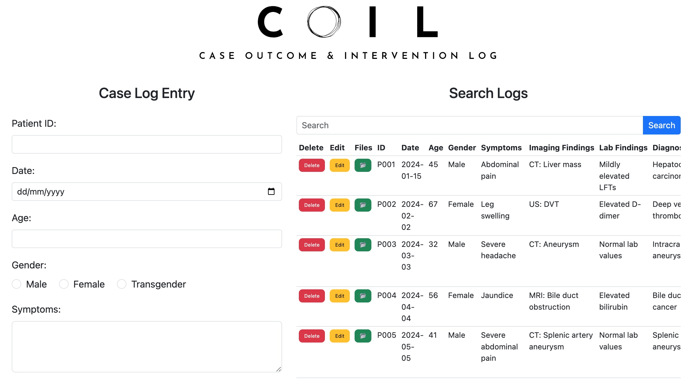

  

  

# COIL 
*Case Outcome & Intervention Log*

COIL is an open-source CRUD (Create, Read, Update, Delete) application built specifically for Interventional Radiology (IR) procedures logbook keeping.  It leverages the power of Google Sheets and Apps Script to provide a simple, yet effective way to manage and log your procedure records and track outcomes.

## Features

* **Simplified Procedure Records:** Easily record and manage case data, including ID, date, age, gender, symptoms, imaging findings, lab results, diagnosis, DSA findings, technical and clinical outcomes, and follow-up information.
* **CRUD Operations:**  Perform all essential database operations:
    * **Create:** Add new case records with ease.
    * **Read:**  View case data, search records, and filter results.
    * **Update:** Modify existing case records as needed.
    * **Delete:** Remove case records securely.
* **Google Drive Integration:**  Directly access case-specific folders in Google Drive with the click of a button.  Folders are automatically created if they don't exist. This integration is useful for saving anonymized radiological/clinical images.
* **Web App Deployment:**  Deploy COIL as a web app for easy access within your institution or practice.

## Patient Privacy Notice

COIL is designed with patient privacy in mind. The application *does not* store patient names to enhance data security.  Users are strongly advised to maintain a separate, secure, and access-controlled record linking patient IDs to their names offline.  This separation of identifiers helps protect patient privacy while still allowing for efficient case management within COIL.

## How to Use COIL

1. **Prerequisites:**
    * A Google account.
    * Basic familiarity with Google Sheets and Google Apps Script.

2. **Make Copies:**
    * **Google Sheet:** Create a copy of the provided COIL Google Sheet template.
    * **Apps Script:**  Make a copy of the provided COIL Apps Script file (`Code.gs`, `CSS.html`, `DataTable.html`, `FormPatientDetails.html`, `Index.html`, `JavaScript.html`, `SpinnerModal.html`).

3. **Configure Apps Script:**
    * **Open Script:** Open the copied Apps Script file.
    * **Update `SpreadsheetID`:**  In the `Code.gs` file, replace the placeholder value `YOUR_SPREADSHEET_ID` with the ID of *your* copied Google Sheet.  You can find the sheet ID in the URL of your Google Sheet.
    * **Update `DRIVE_FOLDER_NAME`:**  In `Code.gs`, set the `DRIVE_FOLDER_NAME` constant to the name you want to use for the parent folder in Google Drive where case folders will be created.
    * **Authorize the Script:** Run any function (like `doGet`) in the script. You'll be prompted to authorize the script to access your Google Sheet and Google Drive.

4. **Enable APIs:**
    * In the Apps Script editor, go to "Resources" > "Advanced Google services".
    * Enable the "Google Drive API" and the "Google Sheets API".

5. **Deploy as a Web App:**
    * In the Apps Script editor, go to "Deploy" > "New deployment".
    * Select "Web app" as the type.
    * Choose "Execute the app as:" "Me (your email address)".
    * Choose "Who has access to the app:" "(Your should prefer to keep it to - 'Only Myself'.)
    * Click "Deploy".
    * Copy the "Web app URL" – this is the URL you'll use to access COIL.

6. **Using the App:**
    * Open the Web App URL in your browser.
    * You can now add, edit, delete, view, and search case records.
    * Click the "📂" button to access or create the corresponding Google Drive folder for a case.

## Screenshot

  
  
<i>COIL WebUI - Shows randomly generated data for illustration</i>

## Development

COIL is open-source and contributions are welcome!  If you'd like to contribute, please fork the repository and submit a pull request.

## Thanks

  * [How to Create an Online Data Entry Form that can Perform CRUD Operations on Google Sheets](https://www.bpwebs.com/crud-operations-on-google-sheets-with-online-forms/) by bpwebs.com

## Disclaimer

COIL is a tool intended **solely for use by healthcare professionals**, specifically those in the field of Interventional Radiology, to maintain a personal logbook of their procedures for professional development and potential future reference (e.g., for employers, research, etc.). It is **not** a substitute for professional medical judgment, a replacement for your institution's primary Hospital Information System (HIS), or a system for managing official patient medical records. COIL should be used as a supplementary tool and not as the primary source of patient information.  It is not intended for use by patients or the general public.

The developers of COIL make no warranties or representations, express or implied, regarding the accuracy, completeness, or reliability of the information stored or managed within the application. Users are solely responsible for verifying the accuracy of the data they enter and for interpreting that data in accordance with established medical guidelines and best practices.

COIL does not guarantee against data loss due to user error, technical issues, or other unforeseen circumstances.  Users are encouraged to maintain regular backups of their data and to use caution when performing delete operations.  The developers of COIL assume no responsibility for any consequences resulting from data loss or inaccuracies within the application.  Using COIL does not constitute the practice of medicine, and the developers shall not be held liable for any adverse outcomes related to patient management based on information managed within the application.  Consult with a qualified healthcare professional for any health concerns or before making any medical decisions.

## License

MIT License
